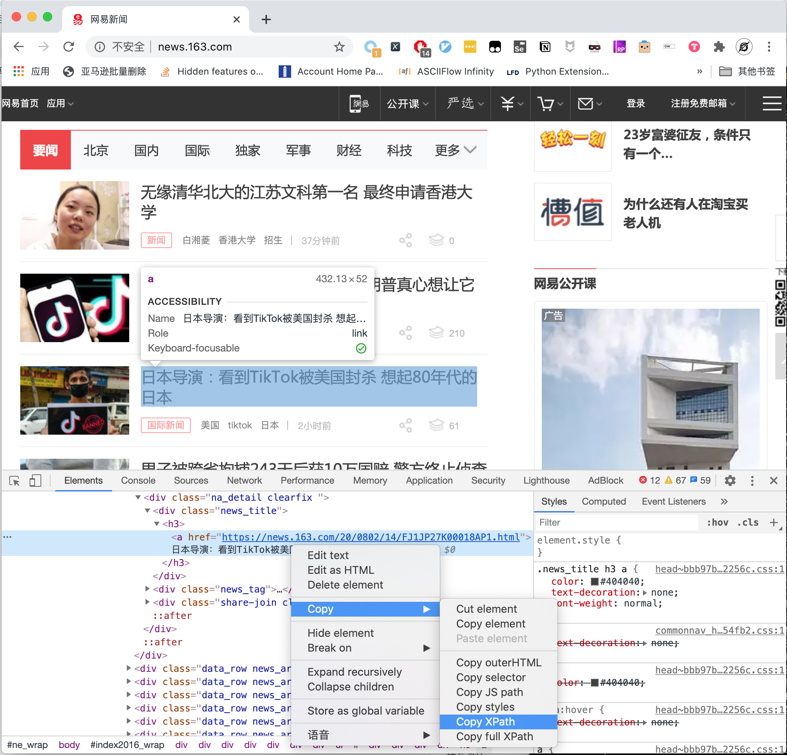
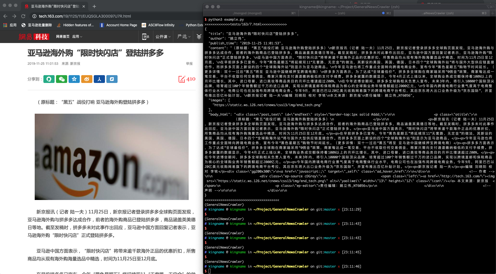
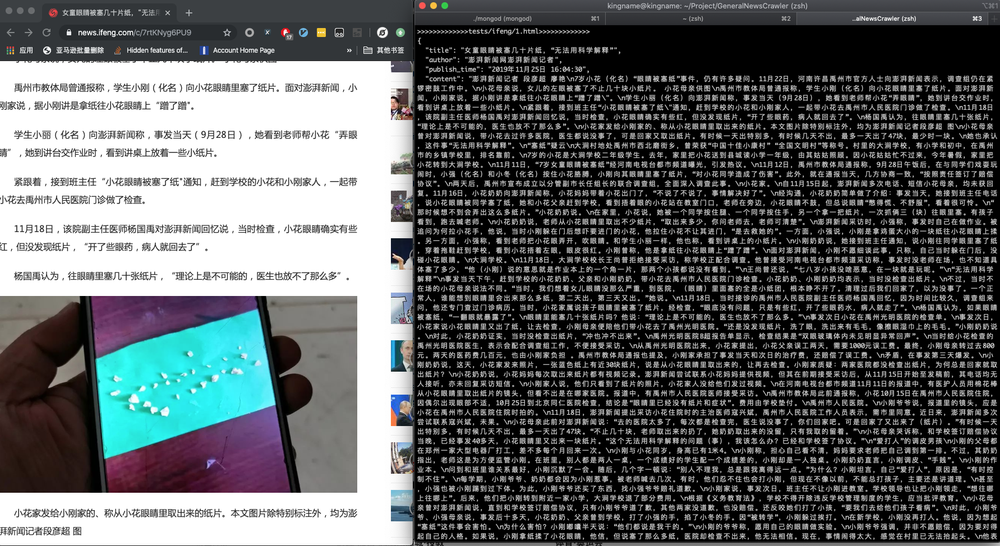

.. GeneralNewsExtractor documentation master file, created by
   sphinx-quickstart on Mon Dec 30 22:49:48 2019.
   You can adapt this file completely to your liking, but it should at least
   contain the root `toctree` directive.

GNE: 通用新闻网站正文抽取器
================================================

.. toctree::
   :maxdepth: 2
   :caption: Contents:

GeneralNewsExtractor（GNE）是一个通用新闻网站正文抽取模块，输入一篇新闻网页的 HTML，
输出正文内容、标题、作者、发布时间、正文中的图片地址和正文所在的标签源代码。GNE在提取今日头条、网易新闻、游民星空、
观察者网、凤凰网、腾讯新闻、ReadHub、新浪新闻等数百个中文新闻网站上效果非常出色，几乎能够达到100%的准确率。

使用方式也非常简单：

.. code-block:: python
   :linenos:

   from gne import GeneralNewsExtractor

   extractor = GeneralNewsExtractor()
   html = '网站源代码'
   result = extractor.extract(html)
   print(result)

本项目取名为 ``抽取器`` ，而不是 ``爬虫`` ，是为了规避不必要的风险，因此，本项目的输入是 HTML源代码，输出是一个字典。请自行使用恰当的方法获取目标网站的 HTML。

**GNE现在不会，将来也不会提供主动请求网站 HTML 的功能。**

如何使用
=============

如果你想体验 GNE 的功能，请按照如下步骤进行：

0. 在线体验

如果你想先体验 GNE 的提取效果，那么你可以访问 `http://gne.kingname.info <http://gne.kingname.info/>`_。
一般情况下，你只需要把网页粘贴到最上面的多行文本框中，然后点 ``提取`` 按钮即可。通过附加更多的参数，可以让提取更精确。具体
参数的写法与作用，请参阅 `API <https://generalnewsextractor.readthedocs.io/zh_CN/latest/#api>`_

1. 安装 GNE

.. code-block:: bash

   # 以下两种方案任选一种即可

   # 使用 pip 安装
   pip install --upgrade gne

   # 使用 pipenv 安装
   pipenv install gne

2. 使用 GNE

>>> from gne import GeneralNewsExtractor
>>> html = '''经过渲染的网页 HTML 代码'''
>>> extractor = GeneralNewsExtractor()
>>> result = extractor.extract(html, noise_node_list=['//div[@class="comment-list"]'])
>>> print(result)
{"title": "xxxx", "publish_time": "2019-09-10 11:12:13", "author": "yyy", "content": "zzzz", "images": ["/xxx.jpg", "/yyy.png"]}

3. 提取列表页

>>> from gne import ListPageExtractor
>>> html = '''经过渲染的网页 HTML 代码'''
>>> list_extractor = ListPageExtractor()
>>> result = list_extractor.extract(html, feature='列表中任意元素的 XPath")
>>> print(result)

注意事项
=========

- 本项目的输入 HTML 为经过 JavaScript 渲染以后的 HTML，而不是普通的网页源代码。所以无论是后端渲染、Ajax 异步加载都适用于本项目。
- 如果你要手动测试新的目标网站或者目标新闻，那么你可以在 Chrome 浏览器中打开对应页面，然后开启 ``开发者工具`` ，如下图所示：

.. image:: _static/2019-09-08-22-20-33.png

在 ``Elements`` 标签页定位到 ``<html>`` 标签，并右键，选择 ``Copy`` - ``Copy OuterHTML`` ，如下图所示

.. image:: _static/2019-09-08-22-21-49.png

- 当然，你可以使用 Puppeteer/Pyppeteer、Selenium 或者其他任何方式获取目标页面的 ``JavaScript渲染后的`` 源代码。
- 获取到源代码以后，通过如下代码提取信息：

.. code-block:: python
   :linenos:

   from gne import GeneralNewsExtractor

   extractor = GeneralNewsExtractor()
   html = '你的目标网页正文'
   result = extractor.extract(html)
   print(result)

- 如果标题自动提取失败了，你可以指定 XPath：

.. code-block:: python
   :linenos:

   from gne import GeneralNewsExtractor

   extractor = GeneralNewsExtractor()
   html = '你的目标网页正文'
   result = extractor.extract(html, title_xpath='//h5/text()')
   print(result)

对大多数新闻页面而言，以上的写法就能够解决问题了。

但某些新闻网页下面会有评论，评论里面可能存在长篇大论，它们会看起来比真正的新闻正文更像是正文，
因此 ``extractor.extract()`` 方法还有一个默认参数 ``noise_node_list`` ，用于在网页预处理时提前把评论区域整个移除。
``noise_mode_list`` 的值是一个列表，列表里面的每一个元素都是 XPath，对应了你需要提前移除的，可能会导致干扰的目标标签。

例如， ``观察者网`` 下面的评论区域对应的Xpath 为 ``//div[@class="comment-list"]`` 。所以在提取观察者网时，为了防止评论干扰，就可以加上这个参数：

.. code-block:: python

   result = extractor.extract(html, noise_node_list=['//div[@class="comment-list"]'])

- ``提取新闻列表页的功能是测试功能，请勿用于生产环境`` 。你可以通过Chrome 浏览器开发者工具中的 ``Copy XPath`` 来复制列表中任意一项的XPath，如下图所示。

GNE 会根据这一项的 XPath，自动找到这个列表里面其他行的数据。

运行截图
=========

网易新闻
--------

今日头条
---------

.. image:: _static/WX20191125-225851.png

新浪新闻
----------

.. image:: _static/WX20191125-231506.png

凤凰网
--------

网易新闻首页列表
---------------

.. image:: _static/WX20200802-170137@2x.png

API
=========

GeneralNewsExtractor 的函数原型为：

.. code-block:: python

   class GeneralNewsExtractor:
       def extract(self,
                   html,
                   title_xpath='',
                   host='',
                   author_xpath='',
                   publish_time_xpath='',
                   body_xpath='',
                   noise_node_list=None,
                   with_body_html=False)

各个参数的意义如下：

- **html(str)**: 必填，目标网站的源代码
- **title_xpath(str)**: 可选，新闻标题的 XPath，用于定向提取标题
- **host(str)**: 可选，图片所在的域名，例如 ``https://www.kingname.info``, 那么，当GNE 从新闻网站提取到图片的相对连接``/images/123.png``时，会把 ``host`` 拼接上去，变成``https://www.kingname.info/images/123.png``
- **body_xpath(str)**: 可选，新闻正文所在的标签的 XPath，用于缩小提取正文的范围，降低噪音
- **noise_node_list(List[str])**: 可选，一个包含 XPath 的列表。这个列表中的 XPath 对应的标签，会在预处理时被直接删除掉，从而避免他们影响新闻正文的提取
- **with_body_html(bool)**: 可选，默认为 False，此时，返回的提取结果不含新闻正文所在标签的 HTML 源代码。当把它设置为 True 时，返回的结果会包含字段 ``body_html``，内容是新闻正文所在标签的 HTML 源代码
- **author_xpath(str)**: 可选，文章作者的 XPath，用于定向提取文章作者
- **publish_time_xpath(str)**: 可选，文章发布时间的 XPath，用于定向提取文章发布时间

ListPageExtractor的函数原型为：

.. code-block:: python

   class ListExtractor:
       def extract(self, element: HtmlElement, feature)

各个参数的意义如下：

- **element(HtmlElement)**：必填，经过 lxml.html.fromstring 处理后的 Dom 树对象
- **feature(str)**: 必填，列表中，任意一行的 XPath 或者内容。GNE 会根据这个 XPath 或者内容，自动找到它所在的列表，并返回该列表下面的全部内容。

配置文件
========

API 中的参数 ``title_xpath``、 ``host``、 ``noise_node_list``、 ``with_body_html`` 、 ``author_xpath`` 、 ``publish_time_xpath`` 、 ``body_xpath`` 除了直接写到 ``extract`` 方法中外，还可以
通过一个配置文件来设置。

请在项目的根目录创建一个文件 ``.gne``，配置文件可以用 YAML 格式，也可以使用 JSON 格式。

- YAML 格式配置文件

.. code-block:: yaml

   title:
       xpath: //title/text()
   host: https://www.xxx.com
   noise_node_list:
       - //div[@class=\"comment-list\"]
       - //*[@style=\"display:none\"]
   body:
       xpath: //div[@class="news-text"]
   with_body_html: true
   author:
       xpath: //meta[@name="author"]/@content
   publish_time:
       xpath: //em[@id="publish_time"]/text()

- JSON 格式配置文件：

.. code-block:: json

   {
       "title": {
           "xpath": "//title/text()"
       },
       "host": "https://www.xxx.com",
       "noise_node_list": ["//div[@class=\"comment-list\"]",
                           "//*[@style=\"display:none\"]"],
       "body": {
           "xpath": "//div[@class=\"news-text\"]"
       },
       "with_body_html": true,
       "author": {
           "xpath": "//meta[@name=\"author\"]/@content"
       },
       "publish_time": {
           "xpath": "//em[@id=\"publish_time\"]/text()"
       }
   }

这两种写法是完全等价的。

配置文件与 ``extract`` 方法的参数一样，并不是所有字段都需要提供。你只需要填写你需要的字段即可。

如果一个参数，既在 ``extract`` 方法中，又在 ``.gne`` 配置文件中，但值不一样，那么 ``extract`` 方法中的这个参数的优先级更高。

已知问题
============

1. 目前本项目只适用于新闻页的信息提取。如果目标网站不是新闻页，或者是今日头条中的相册型文章，那么抽取结果可能不符合预期。
2. 可能会有一些新闻页面出现抽取结果中的作者为空字符串的情况，这可能是由于文章本身没有作者，或者使用了已有正则表达式没有覆盖到的情况。

交流沟通
==========

如果您觉得GNE对您的日常开发或公司有帮助，请加作者微信 mxqiuchen（或扫描下方二维码） 并注明"GNE"，作者会将你拉入群。

.. image:: https://kingname-1257411235.cos.ap-chengdu.myqcloud.com/IMG_3729_2.JPG

验证消息： ``GNE``

如果你不用微信，那么可以加入 Telegram 交流群：`https://t.me/joinchat/Bc5swww_XnVR7pEtDUl1vw <https://t.me/joinchat/Bc5swww_XnVR7pEtDUl1vw>`_

目录
==================

* :ref:`genindex`
* :ref:`modindex`
* :ref:`search`
