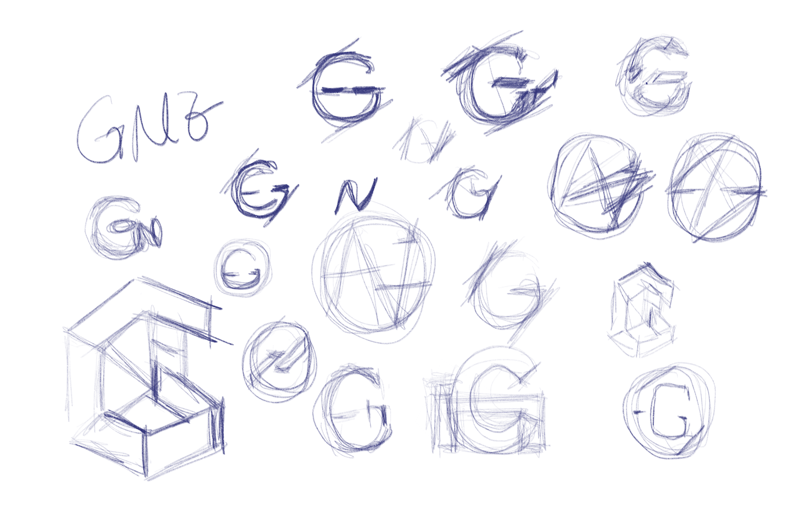
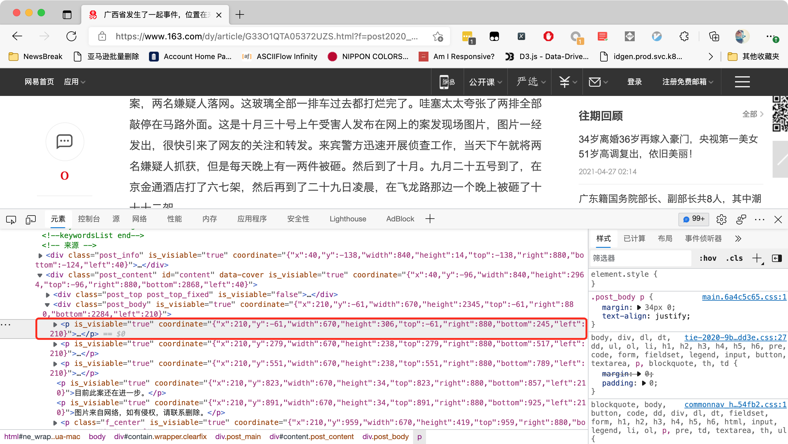
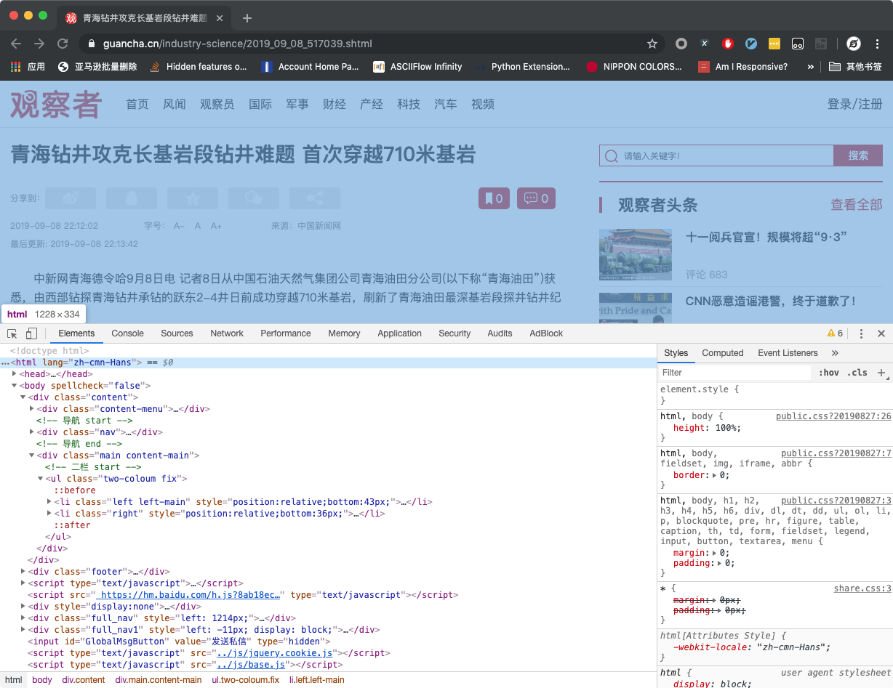
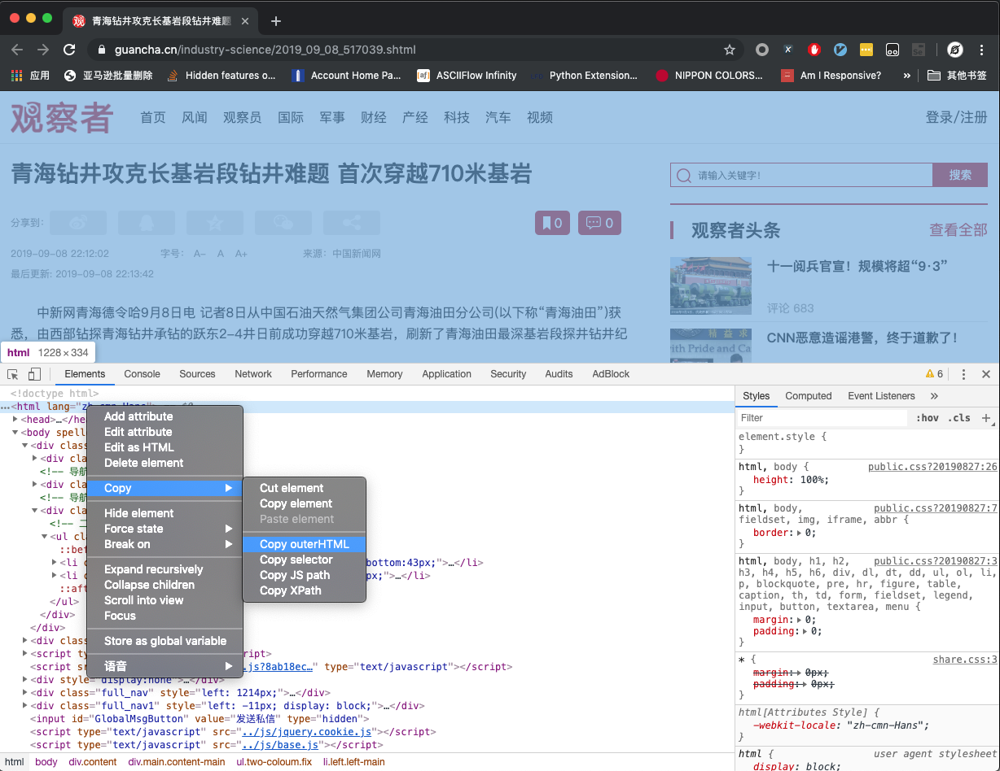
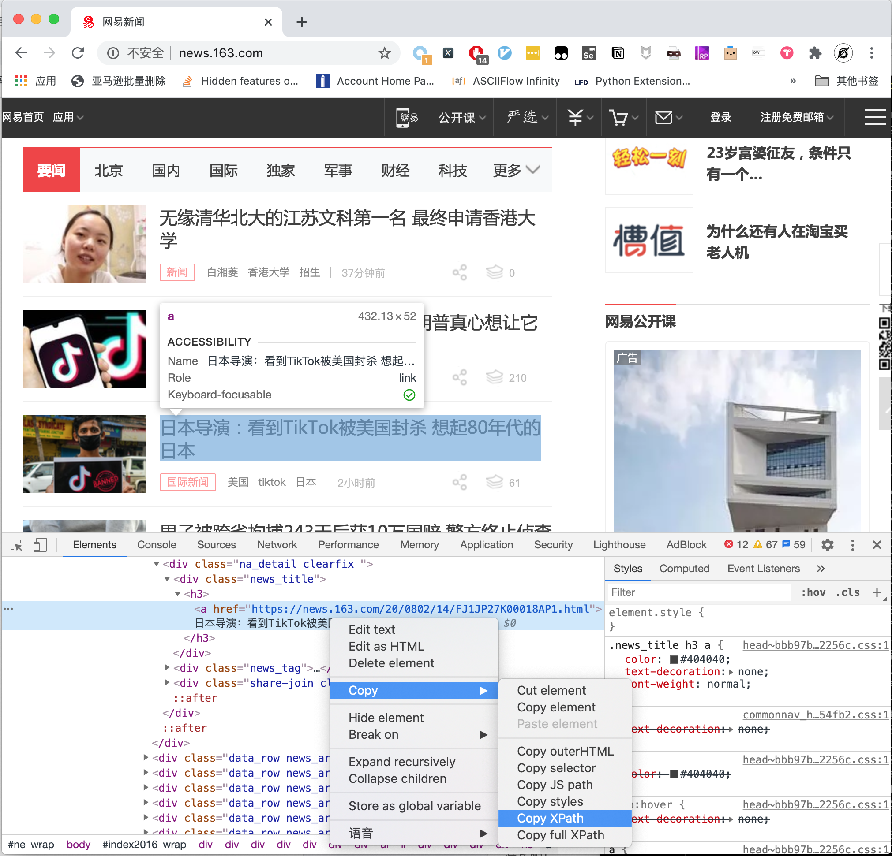
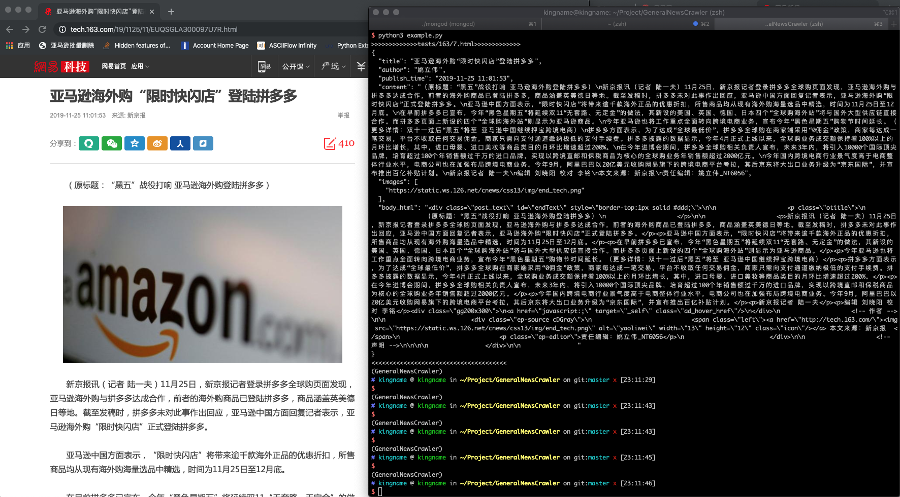
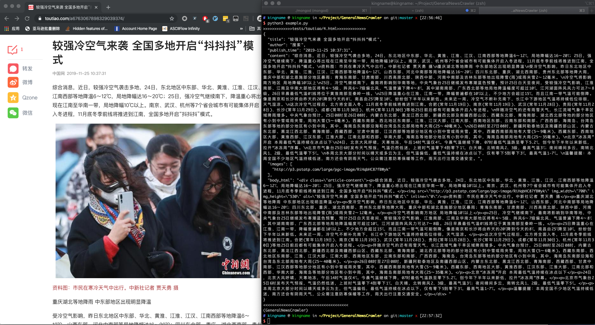
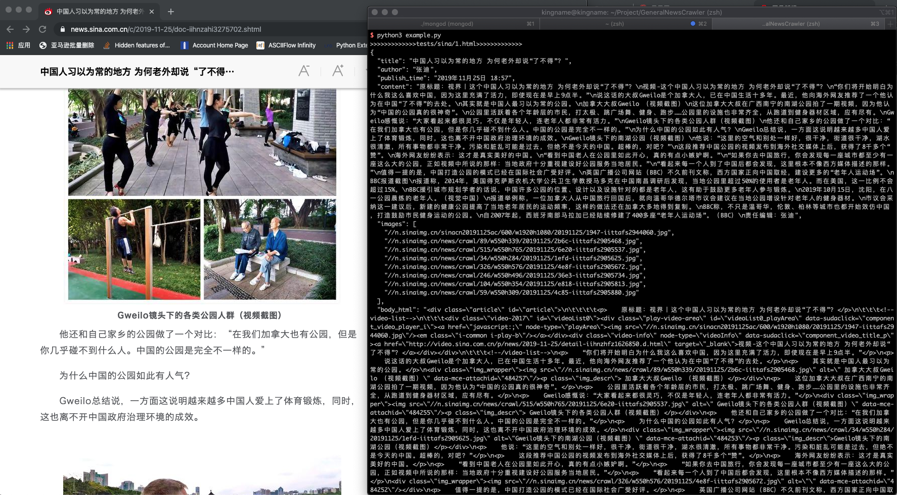
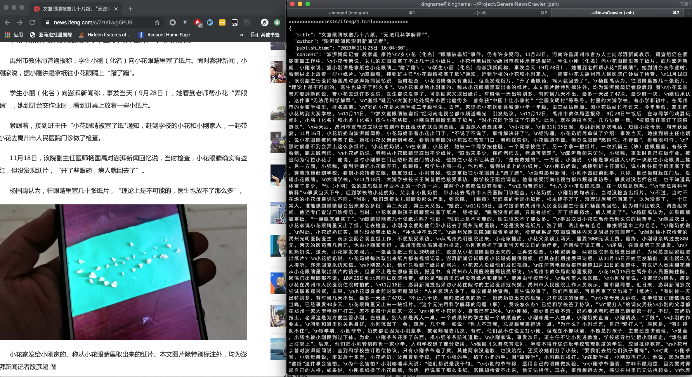
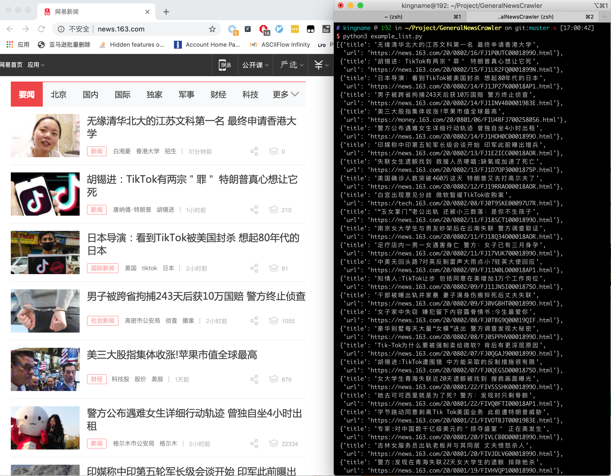

.. GeneralNewsExtractor English documentation

`中文文档 <index.html>`_

GNE: General News Extractor
================================================

.. toctree::
   :maxdepth: 2
   :caption: Contents:

GeneralNewsExtractor (GNE) is a general-purpose news content extraction module for Python. Given the HTML of a news page,
it outputs the article content, title, author, publish time, image URLs, and the HTML source of the content element.
GNE achieves nearly 100% accuracy on hundreds of news websites including Toutiao, NetEase News, Sina News,
iFeng, Tencent News, ReadHub, and many more.

Basic usage is straightforward:

.. code-block:: python
   :linenos:

   from gne import GeneralNewsExtractor

   extractor = GeneralNewsExtractor()
   html = 'HTML source code of the target page'
   result = extractor.extract(html)
   print(result)

This project is named "Extractor" rather than "Crawler" by design — the input is HTML source code, and the output is a dictionary. You are responsible for obtaining the target page's HTML using your own methods.

**GNE does not and will not provide any functionality to actively request HTML from websites.**

How to Use
=============

0. Online Demo

You can try GNE online at `http://gne.kingname.info <http://gne.kingname.info/>`_.
Simply paste the rendered HTML into the text area and click the extract button. For more precise extraction, additional parameters can be provided.
See the `API <https://generalnewsextractor.readthedocs.io/zh_CN/latest/#api>`_ documentation for details.

1. Installation

.. code-block:: bash

   # Choose one of the following methods

   # Install via pip
   pip install --upgrade gne

   # Install via pipenv
   pipenv install gne

2. Basic Extraction

>>> from gne import GeneralNewsExtractor
>>> html = '''Rendered HTML source code'''
>>> extractor = GeneralNewsExtractor()
>>> result = extractor.extract(html, noise_node_list=['//div[@class="comment-list"]'])
>>> print(result)
{"title": "xxxx", "publish_time": "2019-09-10 11:12:13", "author": "yyy", "content": "zzzz", "images": ["/xxx.jpg", "/yyy.png"]}

3. List Page Extraction

>>> from gne import ListPageExtractor
>>> html = '''Rendered HTML source code'''
>>> list_extractor = ListPageExtractor()
>>> result = list_extractor.extract(html, feature='XPath of any element in the list')
>>> print(result)

4. Improving Accuracy with Visibility Information (since GNE 0.3.0)

Open the file ``example_visiable.py`` to see how GNE reads special HTML source code from the ``visiable_test`` directory.
When calling ``extractor.extract()``, pass the parameter ``use_visiable_info=True``. GNE will then use the node coordinate
and visibility information embedded in the HTML to extract the body text more accurately.

The key feature of this special HTML is shown below:

Every node under the ``body`` tag has an attribute called ``is_visiable``, with a string value of ``true`` or ``false``.
If the value is ``true``, there is also a ``coordinate`` attribute containing a JSON string with the node's dimensions and position.

To generate this special HTML, simply execute the following JavaScript on the target page:

.. code-block:: javascript

   function insert_visiability_info() {
       function get_body() {
           var body = document.getElementsByTagName('body')[0]
           return body
       }

       function insert_info(element) {
           is_visiable = element.offsetParent !== null
           element.setAttribute('is_visiable', is_visiable)
           if (is_visiable) {
               react = element.getBoundingClientRect()
               coordinate = JSON.stringify(react)
               element.setAttribute('coordinate', coordinate)
           }
       }

       function iter_node(node) {
           children = node.children
           insert_info(node)
           if (children.length !== 0) {
               for(const element of children) {
                   iter_node(element)
               }
           }
       }

       function sizes() {
           let contentWidth = [...document.body.children].reduce(
             (a, el) => Math.max(a, el.getBoundingClientRect().right), 0)
             - document.body.getBoundingClientRect().x;

           return {
             windowWidth:  document.documentElement.clientWidth,
             windowHeight: document.documentElement.clientHeight,
             pageWidth:    Math.min(document.body.scrollWidth, contentWidth),
             pageHeight:   document.body.scrollHeight,
             screenWidth:  window.screen.width,
             screenHeight: window.screen.height,
             pageX:        document.body.getBoundingClientRect().x,
             pageY:        document.body.getBoundingClientRect().y,
             screenX:     -window.screenX,
             screenY:     -window.screenY - (window.outerHeight-window.innerHeight),
           }
       }

       function insert_page_info() {
           page_info = sizes()
           node = document.createElement('meta')
           node.setAttribute('name', 'page_visiability_info')
           node.setAttribute('page_info', JSON.stringify(page_info))
           document.getElementsByTagName('head')[0].appendChild(node)
       }

       insert_page_info()
       body = get_body()
       iter_node(body)
   }
   insert_visiability_info()

A project using Puppeteer to generate this special HTML is available at: `GneRender <https://github.com/GeneralNewsExtractor/GneRender>`_.
See the ``render.js`` file for details. The same approach applies if you are using Selenium.

Notes
=========

- The input HTML must be **JavaScript-rendered HTML**, not raw page source code. This means GNE works with both server-side rendered and Ajax-loaded content.
- To manually test a new target page, open it in Chrome, launch Developer Tools, as shown below:

In the ``Elements`` tab, locate the ``<html>`` tag, right-click and select ``Copy`` > ``Copy OuterHTML``, as shown below:

- You can also use Puppeteer/Pyppeteer, Selenium, or any other method to obtain the JavaScript-rendered source code.
- Once you have the source code, extract information using the following code:

.. code-block:: python
   :linenos:

   from gne import GeneralNewsExtractor

   extractor = GeneralNewsExtractor()
   html = 'Your target page HTML'
   result = extractor.extract(html)
   print(result)

- If automatic title extraction fails, you can specify a custom XPath:

.. code-block:: python
   :linenos:

   from gne import GeneralNewsExtractor

   extractor = GeneralNewsExtractor()
   html = 'Your target page HTML'
   result = extractor.extract(html, title_xpath='//h5/text()')
   print(result)

For most news pages, the above approach works well.

However, some news pages contain comment sections with lengthy text that may appear more like body content than the actual article.
The ``extractor.extract()`` method provides a ``noise_node_list`` parameter to remove interfering elements during preprocessing.
``noise_node_list`` accepts a list of XPath expressions, each targeting an element to be removed.

For example, to prevent comment interference when extracting from a page where the comment section has the XPath ``//div[@class="comment-list"]``:

.. code-block:: python

   result = extractor.extract(html, noise_node_list=['//div[@class="comment-list"]'])

- **List page extraction is an experimental feature and should not be used in production.** You can use Chrome DevTools' ``Copy XPath`` to copy the XPath of any item in the list, as shown below:

GNE will automatically find other items in the same list based on the provided XPath.

Screenshots
=============

NetEase News
--------------

Toutiao
---------

Sina News
----------

iFeng
--------

NetEase News List Page
-----------------------

API
=========

The ``GeneralNewsExtractor`` class signature:

.. code-block:: python

   class GeneralNewsExtractor:
       def extract(self,
                   html,
                   title_xpath='',
                   host='',
                   author_xpath='',
                   publish_time_xpath='',
                   body_xpath='',
                   noise_node_list=None,
                   with_body_html=False,
                   use_visiable_info=False)

Parameter descriptions:

- **html (str)**: Required. The HTML source code of the target page.
- **title_xpath (str)**: Optional. XPath for the news title, used for targeted title extraction.
- **host (str)**: Optional. The domain for images, e.g., ``https://www.kingname.info``. When GNE extracts a relative image path like ``/images/123.png``, it prepends the host to produce ``https://www.kingname.info/images/123.png``.
- **body_xpath (str)**: Optional. XPath of the tag containing the news body, used to narrow the extraction scope and reduce noise.
- **noise_node_list (List[str])**: Optional. A list of XPath expressions. Tags matching these XPaths are removed during preprocessing to prevent them from interfering with body text extraction.
- **with_body_html (bool)**: Optional. Defaults to ``False``. When set to ``True``, the result includes a ``body_html`` field containing the HTML source of the body text element.
- **author_xpath (str)**: Optional. XPath for the article author, used for targeted author extraction.
- **publish_time_xpath (str)**: Optional. XPath for the publish time, used for targeted publish time extraction.
- **use_visiable_info (bool)**: Optional. Whether the HTML contains node coordinate and visibility information.

The ``ListPageExtractor`` class signature:

.. code-block:: python

   class ListExtractor:
       def extract(self, element: HtmlElement, feature)

Parameter descriptions:

- **element (HtmlElement)**: Required. A DOM tree object processed by ``lxml.html.fromstring``.
- **feature (str)**: Required. The XPath or content of any row in the list. GNE uses this to automatically locate the list and return all its items.

Configuration File
====================

The API parameters ``title_xpath``, ``host``, ``noise_node_list``, ``with_body_html``, ``author_xpath``, ``publish_time_xpath``, ``body_xpath``, and ``use_visiable_info``
can also be set via a configuration file instead of passing them directly to the ``extract`` method.

Create a file named ``.gne`` in your project root directory. The configuration file supports both YAML and JSON formats.

- YAML format:

.. code-block:: yaml

   title:
       xpath: //title/text()
   host: https://www.xxx.com
   noise_node_list:
       - //div[@class=\"comment-list\"]
       - //*[@style=\"display:none\"]
   body:
       xpath: //div[@class="news-text"]
   with_body_html: true
   author:
       xpath: //meta[@name="author"]/@content
   publish_time:
       xpath: //em[@id="publish_time"]/text()
   use_visiable_info: false

- JSON format:

.. code-block:: json

   {
       "title": {
           "xpath": "//title/text()"
       },
       "host": "https://www.xxx.com",
       "noise_node_list": ["//div[@class=\"comment-list\"]",
                           "//*[@style=\"display:none\"]"],
       "body": {
           "xpath": "//div[@class=\"news-text\"]"
       },
       "with_body_html": true,
       "author": {
           "xpath": "//meta[@name=\"author\"]/@content"
       },
       "publish_time": {
           "xpath": "//em[@id=\"publish_time\"]/text()"
       },
       "use_visiable_info": false
   }

These two formats are fully equivalent.

Not all fields are required in the configuration file — only include the ones you need.

If a parameter is specified in both the ``extract`` method and the ``.gne`` configuration file with different values, the ``extract`` method parameter takes precedence.

Known Issues
==============

1. GNE is designed for news article pages. It may not work well on non-news pages or photo gallery articles (e.g., on Toutiao).
2. The author field may be empty if the article does not specify an author or if the author pattern is not covered by the existing regular expressions.

Community
==========

- WeChat: Add the author ``mekingname`` and mention "GNE" to join the group.
- Telegram: `https://t.me/joinchat/Bc5swww_XnVR7pEtDUl1vw <https://t.me/joinchat/Bc5swww_XnVR7pEtDUl1vw>`_

Indices
==================

* :ref:`genindex`
* :ref:`modindex`
* :ref:`search`
